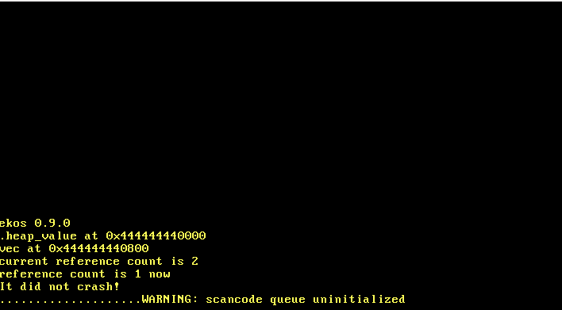

# ekos

`ekos` is a small operating system kernel written in Rust. This project is a learning exercise to understand low-level programming concepts, operating system design, and the Rust programming language.

Referense: [https://os.phil-opp.com/](https://os.phil-opp.com/)

## Features

- Basic memory management
- Heap allocation
- Task management
- Keyboard input handling
- Panic handling

## Screenshot



## Getting Started

### Prerequisites

To build and run `ekos`, you need to have the following tools installed:

- [Rust](https://www.rust-lang.org/tools/install)
- [cargo-xbuild](https://github.com/rust-osdev/cargo-xbuild)
- [bootimage](https://github.com/rust-osdev/bootimage)

### Building

1. Clone the repository:

   ```sh
   git clone https://github.com/yourusername/ekos.git
   cd ekos
   ```

2. Install the required Rust components:

   ```sh
   rustup component add rust-src
   cargo install cargo-xbuild
   cargo install bootimage
   ```

3. Build the project:

   ```sh
   cargo xbuild
   ```

4. Create a bootable disk image:

   ```sh
   cargo bootimage
   ```

### Running

You can run the OS in an emulator like QEMU:
